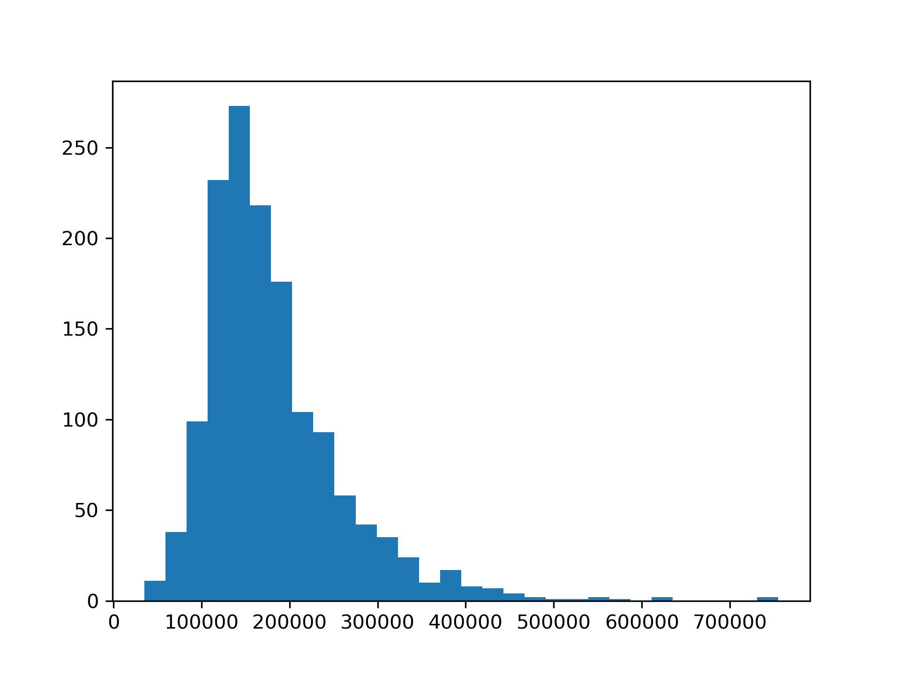
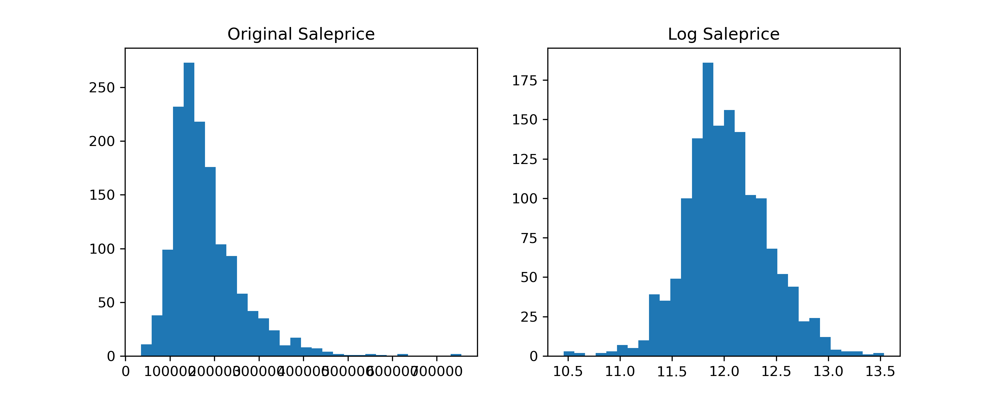
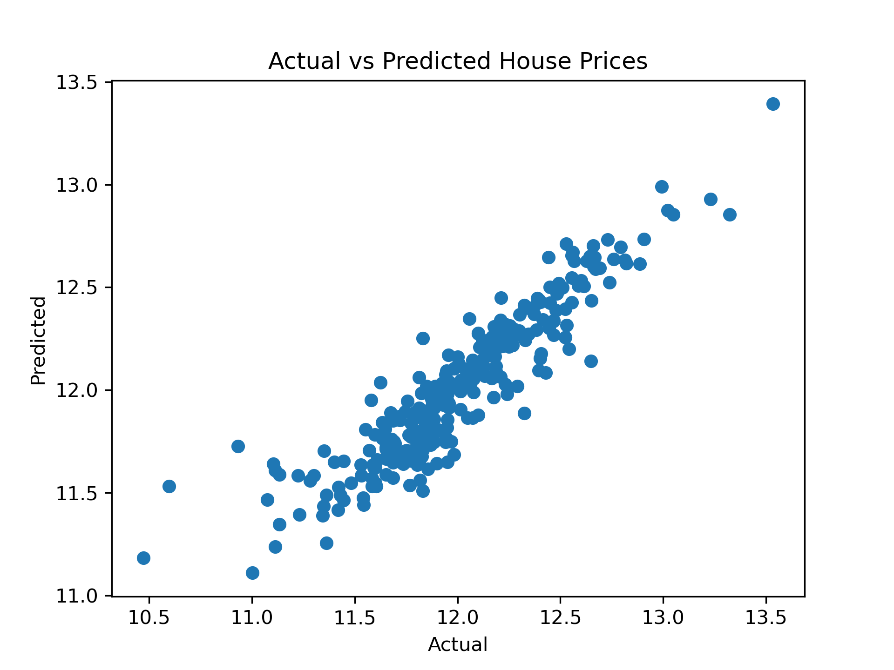

# House Price Prediction

## Project Overview

This project aims to build a machine learning model to predict house prices using various property features such as living area, quality, garage capacity, and building year.

The dataset used in this project comes from the Kaggle competition:
House Prices – Advanced Regression Techniques.

---

## Dataset

The dataset contains information about residential properties, including:

- Living area
- Overall quality
- Garage capacity
- Basement size
- Year built

The target variable is:  SalePrice

---
##  Repository Structure

```text
House-Price-Predictions/
├── README.md
├── requirements.txt
├── notebooks/
│   └── house_price.ipynb
├── data/
│     └── train.csv
└── outputs/
    └── figures/
        ├── price_distribution.png
        └── original_log_saleprice.png
        └── Actual_Predicted_saleprice.png
```
---

## Data Analysis

### 1 Data Cleaning

- Checked missing values
- Categorized missing features by missing ratio
- Reviewed high-missing features but did not include them in the current model
- Filled or kept moderate missing values depending on context

---

### 2 Feature Engineering

Created several new features:

- TotalSF (total square footage)
- HouseAge
- RemodAge
- HasGarage
- HasBasement

---

### 3 Target Transformation

The target variable SalePrice is right-skewed.

A log transformation was applied:

LogSalePrice = log(SalePrice)

This transformation reduces skewness and improves model performance.

---

### 4 Exploratory Data Analysis

Strong correlations were found between house prices and several features:

- OverallQual
- GrLivArea
- GarageCars
- TotalSF

Scatter plots indicate mostly linear relationships between these variables and house prices.

---

### 5 Model

A linear regression model was used.

Train-test split:

80% training  
20% testing

---

### 6 Model Evaluation

Model performance was evaluated using RMSE.

Result:

RMSE ≈ 0.173

The predicted values align well with the actual prices.

---

## Key Findings

The most important factors affecting house prices include:

- Overall quality of the house
- Living area
- Garage capacity
- Total square footage

House quality shows the strongest impact on property value.

---
### Price Distribution 



The target variable SalePrice exhibits a clear right-skewed distribution. 
---
### LogSalePrice Distribution 


The original SalePrice distribution is highly right-skewed. After applying log transformation, the distribution becomes more symmetric. Therefore, LogSalePrice will be used for subsequent modeling.
---
### Actual vs Predicted


The scatter plot compares the actual house prices with the predicted values from the model. Most points lie close to the diagonal trend, indicating that the model predictions align reasonably well with the true values. Some larger deviations appear at higher price ranges, suggesting that the model may have more difficulty predicting very expensive houses.

## Tools Used

- Python
- Pandas
- NumPy
- Matplotlib
- Scikit-learn

---

